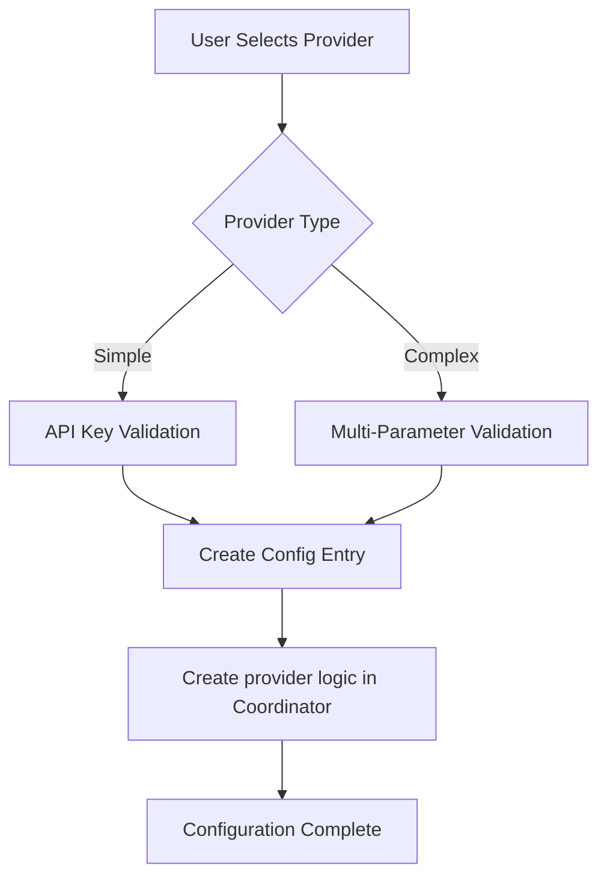

# Adding New AI Providers to the Integration

## Introduction
The integration supports multiple AI providers through a modular architecture. To add a new provider, you need to:
1. Add validation logic
2. Extend the config flow
3. Define provider-specific constants
4. Update the sensor to handle new endpoints

## File Map for Provider Integration

| File | Purpose | Changes Needed |
|------|---------|----------------|
| `const.py` | Constants and defaults | Add new CONF_* constants and default models |
| `config_flow.py` | Provider configuration UI | Add provider to selection list, create schema |
| `coordinator.py` | Core logic and API calls | Implement new provider handler in _dispatch() |
| `sensor.py` | Data presentation | Usually no changes needed |
| `strings.json` | UI literals | Add literals for new provider fields |
| `translations\*strings*.json` | UI translations | Add translations for new provider fields |

## General Steps to Add a Provider

### 1. Define Constants
Add necessary constants in `const.py`:
```python
CONF_NEWPROVIDER_PARAM1 = "newprovider_param1"
CONF_NEWPROVIDER_PARAM2 = "newprovider_param2"
DEFAULT_MODELS["NewProvider"] = "default-model"
```

### 2. Add Validation Method
In `config_flow.py`, extend the `ProviderValidator` class with a new async method:
```python
async def validate_NEWPROVIDER(self, param1: str, param2: int) -> Optional[str]:
    # Implementation
```

### 3. Extend Config Flow
Update the `AIAutomationConfigFlow` class:
- Add provider to the selection list in `async_step_user`
- Create provider-specific schema in `async_step_provider_config`
- Add validation call in the configuration step

### 4. Update Sensor (if needed)
Modify `sensor.py` to handle any special processing for the new provider.

---

## Example 1: Simple Provider (OpenAI)

### Implementation Steps:
1. **Validation Method** (already exists):
```python
async def validate_openai(self, api_key: str) -> Optional[str]:
    hdr = {"Authorization": f"Bearer {api_key}"}
    resp = await self.session.get("https://api.openai.com/v1/models", headers=hdr)
    return None if resp.status == 200 else await resp.text()
```

2. **Config Schema**:
```python
{
    vol.Required(CONF_API_KEY): str,
    vol.Optional(CONF_MODEL, default="gpt-4"): str,
    # ... common fields
}
```

3. **UI Flow**:
- User selects "OpenAI" from provider list
- Enters API key and optional model override

---

## Example 2: Complex Provider (Open Web UI)

### Implementation Steps:
1. **Validation Method**:
```python
async def validate_openwebui(self, ip: str, port: int, https: bool, api_key: str) -> Optional[str]:
    proto = "https" if https else "http"
    hdr = {"Authorization": f"Bearer {api_key}"}
    resp = await self.session.get(f"{proto}://{ip}:{port}/api/tags", headers=hdr)
    return None if resp.status == 200 else await resp.text()
```

2. **Config Schema Additions**:
```python
{
    vol.Optional(CONF_OPENWEBUI_IP_ADDRESS, default="localhost"): str,
    vol.Optional(CONF_OPENWEBUI_PORT, default=11434): int,
    vol.Optional(CONF_OPENWEBUI_HTTPS, default=False): bool,
    vol.Optional(CONF_API_KEY): str,
    # ... common fields
}
```

3. **Constants**:
```python
CONF_OPENWEBUI_IP_ADDRESS = "openwebui_ip"
CONF_OPENWEBUI_PORT = "openwebui_port"
CONF_OPENWEBUI_HTTPS = "openwebui_https"
DEFAULT_MODELS["Open Web UI"] = "llama2"
```

4. **Coordinator's Role in Provider Integration**

The `AIAutomationCoordinator` handles:
1. Gathering entity/automation data
2. Building prompts with token budgeting
3. Dispatching requests to the correct provider
4. Processing responses and extracting YAML
5. Managing error handling and retries

Key methods to modify when adding a provider:
- `_dispatch()`: Add new provider handler
- Provider-specific methods (e.g. `_openai()`, `_anthropic()`)

---

---

## Configuration Flow Diagram



---

## Translation Considerations
Update `strings.json` with new provider name and field descriptions:
```json
{
  "config": {
    "step": {
      "provider_config": {
        "data": {
          "openwebui_ip": "Server IP",
          "openwebui_port": "Server Port"
        }
      }
    }
  }
}
```


