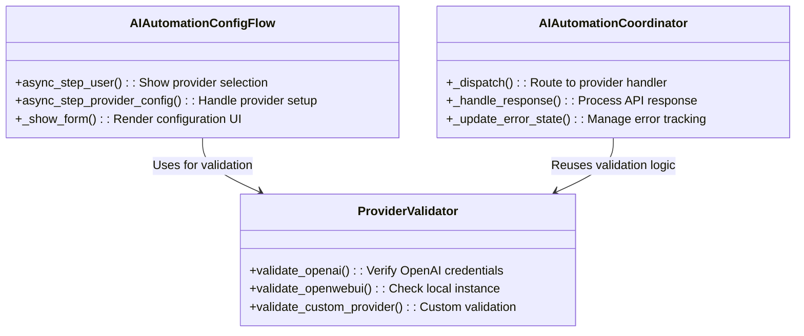
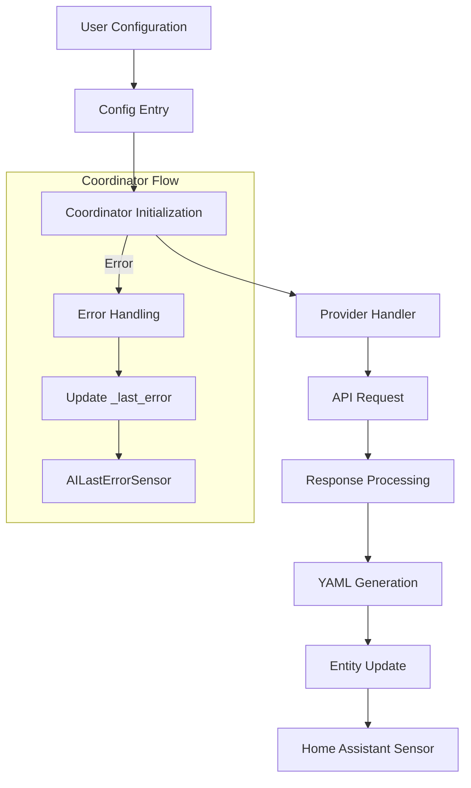
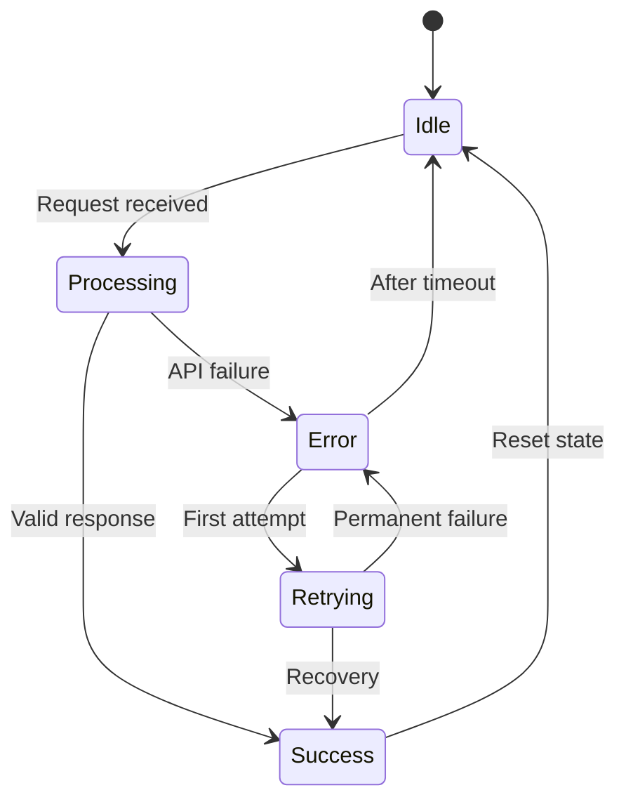
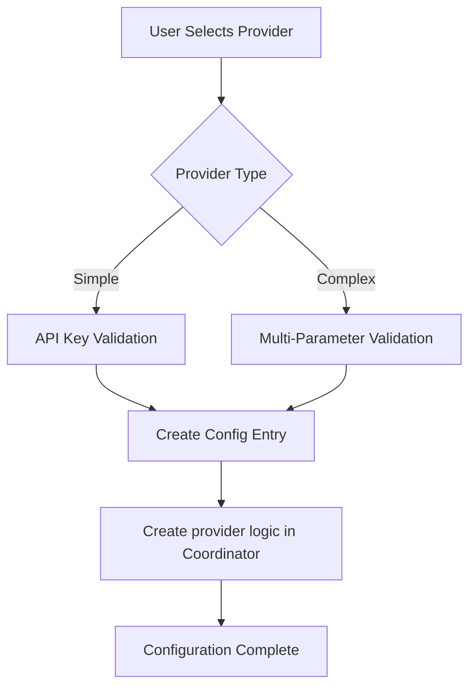

# AI Provider Integration Guide

## Overview
The integration uses a modular provider architecture with these core components:

1. **AIAutomationConfigFlow** ([`config_flow.py:42`](custom_components/ai_automation_suggester/config_flow.py:42)) - Handles provider selection and configuration UI
2. **ProviderValidator** ([`config_flow.py:89`](custom_components/ai_automation_suggester/config_flow.py:89)) - Performs credential/endpoint validation
3. **AIAutomationCoordinator** ([`coordinator.py:35`](custom_components/ai_automation_suggester/coordinator.py:35)) - Manages provider operations and data flow



## Data Flow Architecture



## Provider Lifecycle

### 1. Initialization
- Triggered during config entry setup ([`__init__.py:27`](custom_components/ai_automation_suggester/__init__.py:27))
- Creates coordinator instance with provider configuration
- Registers update listener for config changes

### 2. Validation
- Executed via ProviderValidator methods during setup
- Reuses same validation logic during periodic checks
- Example validation flow:
```python
# config_flow.py:95
async def validate_provider(self, **params):
    if provider == "OpenAI":
        return await self.validate_openai(params["api_key"])
    elif provider == "Custom":
        return await self.validate_custom(params)
```

### 3. Operation
- Requests handled through coordinator's `_dispatch()` ([`coordinator.py:127`](custom_components/ai_automation_suggester/coordinator.py:127))
- Provider-specific handlers implement:
  - API request formatting
  - Headers/auth configuration
  - Response parsing
```python
# coordinator.py:135
async def _dispatch(self, provider, prompt):
    handler = getattr(self, f"_{provider.lower()}_handler", None)
    if handler:
        return await handler(prompt)
    raise NotImplementedError(f"No handler for {provider}")
```

### 4. Error Handling
- Errors captured in `_last_error` property ([`coordinator.py:52`](custom_components/ai_automation_suggester/coordinator.py:52))
- Surface through dedicated sensors:
  - `AILastErrorSensor` shows last error message
  - `AIErrorCountSensor` tracks error frequency
- Automatic retries with exponential backoff

## Configuration Schema
All providers implement this base schema ([`const.py:34`](custom_components/ai_automation_suggester/const.py:34)):

```python
BASE_PROVIDER_SCHEMA = vol.Schema({
    vol.Required(CONF_PROVIDER): str,
    vol.Optional(CONF_MODEL): str,
    vol.Optional(CONF_MAX_TOKENS, default=4000): int,
    vol.Optional(CONF_TEMPERATURE, default=0.7): float,
})
```

### Schema Extension Patterns
| Provider Type | Configuration Fields | Special Features |
|---------------|---------------------|------------------|
| **API Key-based** | `CONF_API_KEY`, `CONF_MODEL`, `CONF_TEMPERATURE` | Standard authentication |
| **Self-hosted** | `CONF_IP_ADDRESS`, `CONF_PORT`, `CONF_HTTPS` | Local network configuration |
| **Cloud Service** | `CONF_REGION`, `CONF_INSTANCE`, `CONF_ENDPOINT` | Cloud-specific parameters |

### Provider-Specific Configuration Options

#### OpenAI
```python
{
    vol.Required(CONF_API_KEY): str,
    vol.Optional(CONF_MODEL, default="gpt-4o-mini"): str,
    vol.Optional(CONF_TEMPERATURE, default=0.7): float,
    # Supports GPT-5 model compatibility detection
}
```

#### OpenAI Azure
```python
{
    vol.Required(CONF_API_KEY): str,
    vol.Optional(CONF_OPENAI_AZURE_ENDPOINT): str,
    vol.Optional(CONF_OPENAI_AZURE_DEPLOYMENT_ID, default="gpt-4o-mini"): str,
    vol.Optional(CONF_OPENAI_AZURE_API_VERSION, default="2025-01-01-preview"): str,
}
```

#### Google
```python
{
    vol.Required(CONF_API_KEY): str,
    vol.Optional(CONF_MODEL, default="gemini-2.0-flash"): str,
    vol.Optional(CONF_GOOGLE_THINKING_MODE, default="default"): vol.In(["default", "custom", "disabled"]),
    vol.Optional(CONF_GOOGLE_THINKING_BUDGET, default=-1): int,
}
```

#### LocalAI
```python
{
    vol.Optional(CONF_LOCALAI_IP_ADDRESS, default="localhost"): str,
    vol.Optional(CONF_LOCALAI_PORT, default=8080): int,
    vol.Optional(CONF_LOCALAI_HTTPS, default=False): bool,
}
```

#### Ollama
```python
{
    vol.Optional(CONF_OLLAMA_IP_ADDRESS, default="localhost"): str,
    vol.Optional(CONF_OLLAMA_PORT, default=11434): int,
    vol.Optional(CONF_OLLAMA_HTTPS, default=False): bool,
    vol.Optional(CONF_OLLAMA_DISABLE_THINK, default=False): bool,
}
```

#### Open Web UI
```python
{
    vol.Optional(CONF_OPENWEBUI_IP_ADDRESS, default="localhost"): str,
    vol.Optional(CONF_OPENWEBUI_PORT, default=11434): int,
    vol.Optional(CONF_OPENWEBUI_HTTPS, default=False): bool,
    vol.Optional(CONF_OPENWEBUI_DISABLE_THINK, default=False): bool,
    vol.Optional(CONF_API_KEY): str,  # Optional authentication
}
```

#### OpenRouter
```python
{
    vol.Required(CONF_API_KEY): str,
    vol.Optional(CONF_MODEL, default="meta-llama/llama-4-maverick:free"): str,
    vol.Optional(CONF_OPENROUTER_REASONING_MAX_TOKENS, default=0): int,
}
```

#### Generic OpenAI
```python
{
    vol.Required(CONF_GENERIC_OPENAI_ENDPOINT): str,
    vol.Optional(CONF_GENERIC_OPENAI_VALIDATION_ENDPOINT): str,
    vol.Optional(CONF_GENERIC_OPENAI_ENABLE_VALIDATION, default=False): bool,
    vol.Optional(CONF_API_KEY): str,  # Optional authentication
}
```

## Implementation Guide

### 1. Provider Definition
Register new providers in [`const.py`](custom_components/ai_automation_suggester/const.py):
```python
# Example: HuggingFace provider constants
CONF_HF_API_KEY = "hf_api_key"  # API key for authentication
CONF_HF_ENDPOINT = "hf_endpoint"  # Custom endpoint URL
DEFAULT_MODELS["HuggingFace"] = "gpt2"  # Default model selection
```

### 2. Validation Implementation
Add validation methods to [`config_flow.py`](custom_components/ai_automation_suggester/config_flow.py):
```python
class ProviderValidator:
    async def validate_openai(self, api_key: str) -> Optional[str]:
        """Validate OpenAI API key by testing models endpoint"""
        headers = {"Authorization": f"Bearer {api_key}", "Content-Type": "application/json"}
        try:
            resp = await self.session.get("https://api.openai.com/v1/models", headers=headers)
            return None if resp.status == 200 else await resp.text()
        except Exception as err:
            return str(err)

    async def validate_google(self, api_key: str, model: str) -> Optional[str]:
        """Validate Google API key and model availability"""
        url = f"https://generativelanguage.googleapis.com/v1beta/models/{model}:generateContent?key={api_key}"
        payload = {"contents": [{"parts": [{"text": "ping"}]}]}
        try:
            resp = await self.session.post(url, json=payload)
            return None if resp.status == 200 else await resp.text()
        except Exception as err:
            return str(err)

    async def validate_ollama(self, ip: str, port: int, https: bool) -> Optional[str]:
        """Validate Ollama local instance availability"""
        proto = "https" if https else "http"
        try:
            resp = await self.session.get(f"{proto}://{ip}:{port}/api/tags")
            return None if resp.status == 200 else await resp.text()
        except Exception as err:
            return str(err)

    async def validate_openwebui(self, ip: str, port: int, https: bool, api_key: str) -> Optional[str]:
        """Validate Open Web UI instance with optional authentication"""
        headers = {"Authorization": f"Bearer {api_key}", "Content-Type": "application/json"}
        proto = "https" if https else "http"
        try:
            resp = await self.session.get(f"{proto}://{ip}:{port}/api/tags", headers=headers)
            return None if resp.status == 200 else await resp.text()
        except Exception as err:
            return str(err)
```

### 3. Config Flow Extension
Update [`config_flow.py`](custom_components/ai_automation_suggester/config_flow.py) with UI integration:
```python
class AIAutomationConfigFlow(config_entries.ConfigFlow, domain=DOMAIN):
    # Add to provider selection list
    async def async_step_user(self, user_input=None):
        return self.async_show_form(
            step_id="provider_select",
            data_schema=vol.Schema({
                vol.Required(CONF_PROVIDER): vol.In([
                    "OpenAI",
                    "OpenWebUI",
                    "HuggingFace"  # New provider entry
                ])
            })
        )
    
    # Create provider-specific configuration
    async def async_step_provider_config(self, user_input=None):
        if user_input["provider"] == "HuggingFace":
            schema = BASE_PROVIDER_SCHEMA.extend({
                vol.Required(CONF_HF_API_KEY): str,
                vol.Required(CONF_HF_ENDPOINT): str
            })
            return self.async_show_form(
                step_id="provider_config",
                data_schema=schema,
                errors=self.errors
            )
```

### 4. Coordinator Integration
Implement dispatch handler in [`coordinator.py`](custom_components/ai_automation_suggester/coordinator.py):
```python
class AIAutomationCoordinator:
    async def _huggingface_handler(self, prompt: str):
        """Handle HuggingFace API requests with error tracking"""
        headers = {
            "Authorization": f"Bearer {self.config[CONF_HF_API_KEY]}",
            "Content-Type": "application/json"
        }
        
        payload = {
            "inputs": prompt,
            "parameters": {
                "max_new_tokens": self.config.get(CONF_MAX_TOKENS, 4000),
                "temperature": self.config.get(CONF_TEMPERATURE, 0.7),
                "top_p": 0.9
            }
        }
        
        try:
            async with async_timeout.timeout(30):
                async with self.session.post(
                    f"{self.config[CONF_HF_ENDPOINT]}/generate",
                    headers=headers,
                    json=payload
                ) as resp:
                    if resp.status != 200:
                        self._last_error = f"API error {resp.status}"
                        self.logger.error("HuggingFace API failure: %s", await resp.text())
                        return None
                        
                    data = await resp.json()
                    return self._extract_yaml(data[0]["generated_text"])
                    
        except (asyncio.TimeoutError, aiohttp.ClientError) as err:
            self._last_error = f"Connection error: {str(err)}"
            return None
```

## Error Handling Architecture


## Translation Management
Update translation files in [`translations/`](custom_components/ai_automation_suggester/translations/) with provider-specific strings:
```json
// en.json example
{
  "config": {
    "step": {
      "provider_config": {
        "data": {
          "hf_api_key": "HuggingFace API Key",
          "hf_endpoint": "Endpoint URL",
          "hf_model": "Model Selection"
        },
        "description": "Configure HuggingFace provider settings"
      }
    },
    "abort": {
      "invalid_hf_credentials": "Invalid HuggingFace credentials",
      "hf_connection_error": "Could not connect to HuggingFace endpoint"
    },
    "error": {
      "hf_model_unavailable": "Selected model not available"
    }
  }
}
```

## Best Practices
1. **Validation**: Implement comprehensive checks in ProviderValidator
   - Verify API keys format (prefix matching)
   - Check endpoint accessibility
   - Validate port ranges
2. **Error Handling**:
   - Differentiate between temporary and permanent errors
   - Implement exponential backoff for retries
3. **Security**:
   - Never log sensitive credentials
   - Use secure storage for API keys
4. **Performance**:
   - Set reasonable timeouts (10-30 seconds)
   - Limit maximum token counts
5. **Testing**:
   - Verify with both valid and invalid configurations
   - Test error recovery scenarios
   - Validate translation coverage

## Supported Providers

The integration currently supports **15 AI providers**:

| Provider | Type | Authentication | Local/Cloud | Special Features |
|----------|------|----------------|-------------|------------------|
| **OpenAI** | Cloud API | API Key | Cloud | GPT-5 model compatibility detection |
| **OpenAI Azure** | Cloud API | API Key | Cloud | Azure-specific deployment configuration |
| **Anthropic** | Cloud API | API Key | Cloud | Claude models with enhanced error handling |
| **Google** | Cloud API | API Key | Cloud | Thinking modes, custom budgets, search integration |
| **Groq** | Cloud API | API Key | Cloud | High-speed inference optimized |
| **LocalAI** | Self-hosted | None | Local | Local OpenAI-compatible API |
| **Ollama** | Self-hosted | None | Local | Local models with think control |
| **Open Web UI** | Self-hosted | Optional | Local | Web interface with think control |
| **Custom OpenAI** | Self-hosted | Optional | Local | Custom endpoint configuration |
| **Mistral AI** | Cloud API | API Key | Cloud | Mistral model family support |
| **Perplexity AI** | Cloud API | API Key | Cloud | Search-enhanced responses |
| **OpenRouter** | Cloud API | API Key | Cloud | Multi-provider routing, reasoning tokens |
| **Generic OpenAI** | Self-hosted | Optional | Local | Universal OpenAI-compatible API |
| **Codestral** | Cloud API | API Key | Cloud | Code-focused model |
| **Venice AI** | Cloud API | API Key | Cloud | Uncensored model access |

## Introduction
The integration supports multiple AI providers through a modular architecture. To add a new provider, you need to:
1. Add validation logic
2. Extend the config flow
3. Define provider-specific constants
4. Update the sensor to handle new endpoints

## File Map for Provider Integration

| File | Purpose | Changes Needed |
|------|---------|----------------|
| `const.py` | Constants and defaults | Add new CONF_* constants and default models |
| `config_flow.py` | Provider configuration UI | Add provider to selection list, create schema |
| `coordinator.py` | Core logic and API calls | Implement new provider handler in _dispatch() |
| `sensor.py` | Data presentation | Usually no changes needed |
| `strings.json` | UI literals | Add literals for new provider fields |
| `translations\*strings*.json` | UI translations | Add translations for new provider fields |

## General Steps to Add a Provider

### 1. Define Constants
Add necessary constants in `const.py`:
```python
CONF_NEWPROVIDER_PARAM1 = "newprovider_param1"
CONF_NEWPROVIDER_PARAM2 = "newprovider_param2"
DEFAULT_MODELS["NewProvider"] = "default-model"
```

### 2. Add Validation Method
In `config_flow.py`, extend the `ProviderValidator` class with a new async method:
```python
async def validate_NEWPROVIDER(self, param1: str, param2: int) -> Optional[str]:
    # Implementation
```

### 3. Extend Config Flow
Update the `AIAutomationConfigFlow` class:
- Add provider to the selection list in `async_step_user`
- Create provider-specific schema in `async_step_provider_config`
- Add validation call in the configuration step

### 4. Update Sensor (if needed)
Modify `sensor.py` to handle any special processing for the new provider.

---

## Example 1: Simple Provider (OpenAI)

### Implementation Steps:
1. **Validation Method** (already exists):
```python
async def validate_openai(self, api_key: str) -> Optional[str]:
    hdr = {"Authorization": f"Bearer {api_key}"}
    resp = await self.session.get("https://api.openai.com/v1/models", headers=hdr)
    return None if resp.status == 200 else await resp.text()
```

2. **Config Schema**:
```python
{
    vol.Required(CONF_API_KEY): str,
    vol.Optional(CONF_MODEL, default="gpt-4"): str,
    # ... common fields
}
```

3. **UI Flow**:
- User selects "OpenAI" from provider list
- Enters API key and optional model override

---

## Example 2: Complex Provider (Open Web UI)

### Implementation Steps:
1. **Validation Method**:
```python
async def validate_openwebui(self, ip: str, port: int, https: bool, api_key: str) -> Optional[str]:
    proto = "https" if https else "http"
    hdr = {"Authorization": f"Bearer {api_key}"}
    resp = await self.session.get(f"{proto}://{ip}:{port}/api/tags", headers=hdr)
    return None if resp.status == 200 else await resp.text()
```

2. **Config Schema Additions**:
```python
{
    vol.Optional(CONF_OPENWEBUI_IP_ADDRESS, default="localhost"): str,
    vol.Optional(CONF_OPENWEBUI_PORT, default=11434): int,
    vol.Optional(CONF_OPENWEBUI_HTTPS, default=False): bool,
    vol.Optional(CONF_API_KEY): str,
    # ... common fields
}
```

3. **Constants**:
```python
CONF_OPENWEBUI_IP_ADDRESS = "openwebui_ip"
CONF_OPENWEBUI_PORT = "openwebui_port"
CONF_OPENWEBUI_HTTPS = "openwebui_https"
DEFAULT_MODELS["Open Web UI"] = "llama2"
```

### Current Default Models

The implementation includes these default models for each provider:

```python
DEFAULT_MODELS = {
    "OpenAI": "gpt-4o-mini",
    "OpenAI Azure": "gpt-4o-mini",
    "Anthropic": "claude-3-7-sonnet-latest",
    "Google": "gemini-2.0-flash",
    "Groq": "llama3-8b-8192",
    "LocalAI": "llama3",
    "Ollama": "llama2",
    "Custom OpenAI": "gpt-3.5-turbo",
    "Mistral AI": "mistral-medium",
    "Perplexity AI": "sonar",
    "OpenRouter": "meta-llama/llama-4-maverick:free",
    "Generic OpenAI": "gpt-3.5-turbo",
    "Codestral": "codestral-latest",
    "Venice AI": "venice-uncensored",
    "Open Web UI": "llama2",
}
```

4. **Coordinator's Role in Provider Integration**

The `AIAutomationCoordinator` handles:
1. Gathering entity/automation data
2. Building prompts with token budgeting
3. Dispatching requests to the correct provider
4. Processing responses and extracting YAML
5. Managing error handling and retries

Key methods to modify when adding a provider:
- `_dispatch()`: Add new provider handler
- Provider-specific methods (e.g. `_openai()`, `_anthropic()`)

---

---

## Configuration Flow Diagram



---

## Translation Considerations
Update `strings.json` with new provider name and field descriptions:
```json
{
  "config": {
    "step": {
      "provider_config": {
        "data": {
          "openwebui_ip": "Server IP",
          "openwebui_port": "Server Port"
        }
      }
    }
  }
}
```
